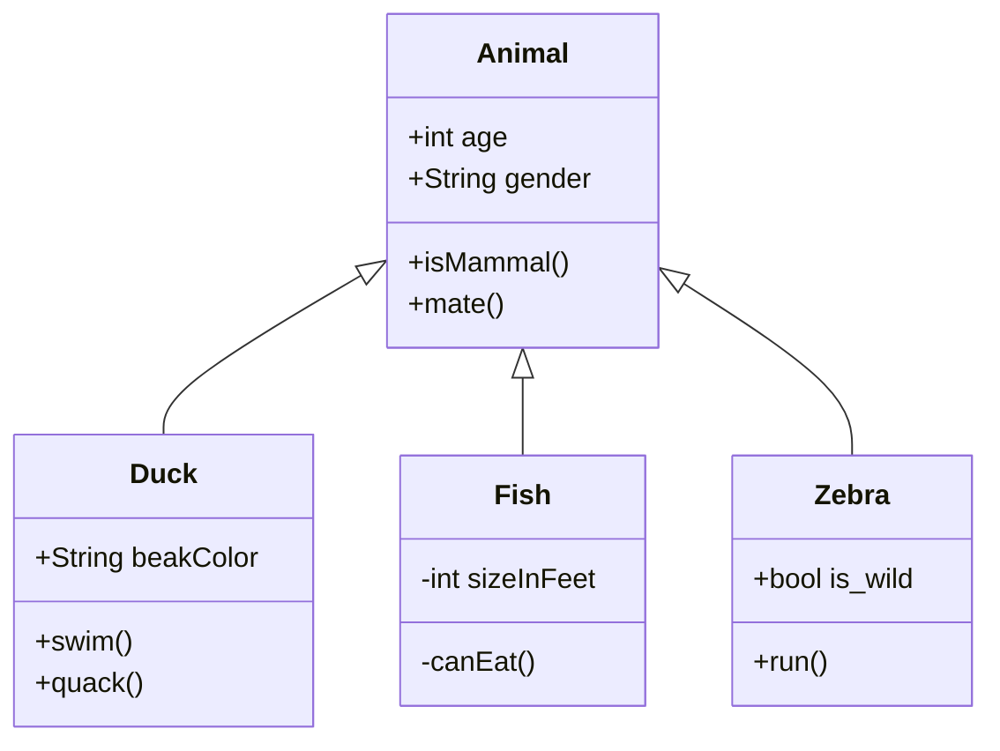

# README

## GitHub-Seite

Das ist die Startseite des GitHub-Repositorys des Spiels. Es hat allerdings noch keinen Namen und kein genaues Konzept. Wenn ihr irgendwas hier hinzufügen wollt. Mach dafür bitte einen neuen Branch und erstellt einen *pull request* und commited   nicht in den `master`- Branch.

Ihr solltet auf keine vertraulichen Informationen etc. in die Dokumentation, den Source-Code oder in irgendwelche anderen Files schreiben, weil das gesamte Repo mit dem Link für jeden zugänglich ist.

## Dinge

### Markdown

Markdown ist eine Markup-Sprache, mit der solche Texte wie dieser elegant formatiert werden können. Mehr [hier](https://github.github.com/gfm/). Ein guter Markdown - Editor ist [Typora](https://typora.io).

### Eclipse

Das IDE was wir benutzen: https://www.eclipse.org/

### Git

Diese Plattform, die zum Verwalten des Codes verwendet wird: https://git-scm.com/downloads

