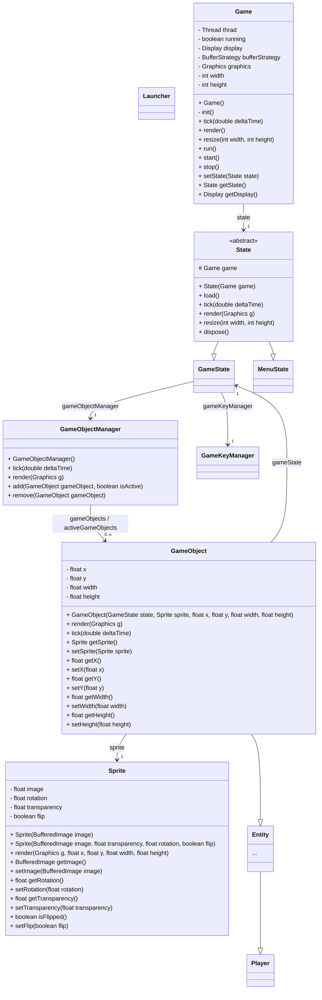

# UML-Diagramme
## Game, States und Launcher

```mermaid
classDiagram
	class Launcher {
	
	}
	
    class Game {
		- Thread thrad
		- boolean running
		- Display display
		- BufferStrategy bufferStrategy
		- Graphics graphics
		- int width
		- int height
		+ Game()
		- init()
		+ tick(double deltaTime)
		+ render()
		+ resize(int width, int height)
		+ run()
		+ start()
		+ stop()
		+ setState(State state)
		+ State getState()
		+ Display getDisplay()
	}
	
	Game --> "1" State: state
	
	<<abstract>> State
	
	class State {
		# Game game
		+ State(Game game)
		+ load()
		+ tick(double deltaTime)
		+ render(Graphics g)
		+ resize(int width, int height)
		+ dispose()
	}
	
	State --|> GameState
	class GameState {
	
	}
	GameState --> "1" GameObjectManager: gameObjectManager
	GameState --> "1" GameKeyManager: gameKeyManager
	
	State --|> MenuState
	class MenuState {
	
	}
	
	
	
	class GameObjectManager {
		+ GameObjectManager()
		+ tick(double deltaTime)
		+ render(Graphics g)
		+ add(GameObject gameObject, boolean isActive)
		+ remove(GameObject gameObject)
	}
	GameObjectManager --> "0..n" GameObject: gameObjects / activeGameObjects
	
	class GameObject {
		- float x
		- float y
		- float width
		- float height
		+ GameObject(GameState state, Sprite sprite, float x, float y, float width, float height)
		+ render(Graphics g)
		+ tick(double deltaTime)
		+ Sprite getSprite()
		+ setSprite(Sprite sprite)
		+ float getX()
		+ setX(float x)
		+ float getY()
		+ setY(float y)
		+ float getWidth()
		+ setWidth(float width)
		+ float getHeight()
		+ setHeight(float height)
	}
	GameObject --> "1" GameState: gameState
	GameObject --> "1" Sprite: sprite
	GameObject --|> Entity
	
	class Entity {
		...
	}
	Entity --|> Player
	
	class Sprite {
		- float image
		- float rotation
		- float transparency
		- boolean flip
		+ Sprite(BufferedImage image)
		+ Sprite(BufferedImage image, float transparency, float rotation, boolean flip)
		+ render(Graphics g, float x, float y, float width, float height)
		+ BufferedImage getImage()
		+ setImage(BufferedImage image)
		+ float getRotation()
		+ setRotation(float rotation)
		+ float getTransparency()
		+ setTransparency(float transparency)
		+ boolean isFlipped()
		+ setFlip(boolean flip)
	}
	
```

